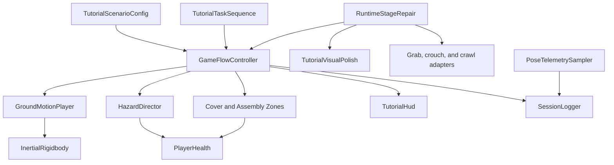

# Software Architecture

`UniversalSceneGameplayBootstrap` runs after a supported scene loads. Tutorial scenes retain their generated `GameFlowController` and receive shared footwear, pillow, window, camera, and local-co-op features. `House.unity` retains its authored mesh and receives a runtime-built gameplay layer managed by `HouseScenarioController`. This isolates scene art from mechanics and prevents the house from being overwritten by the lab builder.

`PlayerHealth` tracks protection as named sources. `CoverZone` and `ProtectivePillow` can therefore overlap safely. `ToppleableFurniture` derives its overturning force from `GroundMotionPlayer`; `BreakableWindow` derives its crack threshold from the same normalized intensity.

## Runtime ownership

`GameFlowController` owns phase sequencing but does not calculate motion or directly manage rigidbody physics. Recorded profiles, art assets, and player rigs can therefore change without rewriting the state machine.

`GeneratedStageInfo` versions builder output. `RuntimeStageRepair` runs before tutorial validation and upgrades the committed legacy scene in memory when necessary, including the missing chair/grab path and readable desktop HUD. `TutorialVisualPolish` then applies the final material, lighting, wayfinding, interaction-feedback, and HUD presentation consistently to legacy and rebuilt scenes. The editor validator remains the persistent-scene authoring gate.

## Assembly boundaries

| Assembly | Platform | Responsibility |
|---|---|---|
| `CEVR.Runtime` | All player builds | Gameplay, physical response, UI, logging, and player adapters |
| `CEVR.Editor` | Unity Editor only | Stage generation, CSV import, and scene validation |
| `CEVR.Tests` | Editor tests | Pure rules, health behavior, and profile correctness |

Runtime code does not reference `UnityEditor`. Editor code may reference Runtime. Test code references Runtime but is excluded from player builds.

## Data flow

1. Configuration defines mode, timings, and rules.
2. Game flow enters each phase and commands motion and hazards.
3. Ground motion sends acceleration to physical objects, never a transform to the camera.
4. Zones and hazards update PlayerHealth and report events to game flow.
5. Game flow updates the HUD and writes semantic events.
6. Pose telemetry writes a separate 10 Hz stream into the same session log.
7. Runtime scene preparation changes presentation and compatibility objects only; it does not change experimental timing, quake acceleration, damage rules, or outcome logic.

## Determinism boundary

- Phase timing uses unscaled time.
- Preview motion uses the scenario seed.
- Hazard order is a serialized list.
- The earthquake path contains no `Random.Range` or random torque.
- Unity physics may still vary slightly across platforms. A study must freeze the platform, Unity version, fixed timestep, build hash, and motion profile.

## Extension points

- New ordinary activity: add a `TutorialTask` and a component that calls `Complete()`.
- New recorded motion: create or import a `QuakeProfile`.
- New floor condition: assign a separately calibrated `FloorResponseProfile`.
- New outcome measure: subscribe to an existing event or add a semantic event without identity fields.
- New XR device: replace the player adapter according to `XR_SETUP.md` while preserving PlayerHealth and zone contracts.
