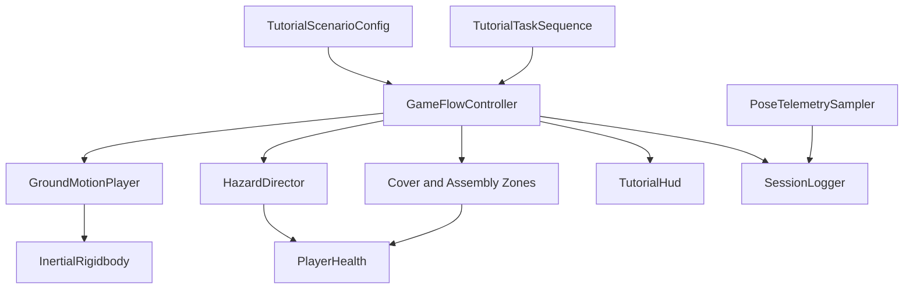

# Software Architecture

## Runtime ownership

`GameFlowController` owns phase sequencing but does not calculate motion or directly manage rigidbody physics. Recorded profiles, art assets, and player rigs can therefore change without rewriting the state machine.

## Assembly boundaries

| Assembly | Platform | Responsibility |
|---|---|---|
| `CEVR.Runtime` | All player builds | Gameplay, physical response, UI, logging, and player adapters |
| `CEVR.Editor` | Unity Editor only | Stage generation, CSV import, and scene validation |
| `CEVR.Tests` | Editor tests | Pure rules, health behavior, and profile correctness |

Runtime code does not reference `UnityEditor`. Editor code may reference Runtime. Test code references Runtime but is excluded from player builds.

## Data flow

1. Configuration defines mode, timings, and rules.
2. Game flow enters each phase and commands motion and hazards.
3. Ground motion sends acceleration to physical objects, never a transform to the camera.
4. Zones and hazards update PlayerHealth and report events to game flow.
5. Game flow updates the HUD and writes semantic events.
6. Pose telemetry writes a separate 10 Hz stream into the same session log.

## Determinism boundary

- Phase timing uses unscaled time.
- Preview motion uses the scenario seed.
- Hazard order is a serialized list.
- The earthquake path contains no `Random.Range` or random torque.
- Unity physics may still vary slightly across platforms. A study must freeze the platform, Unity version, fixed timestep, build hash, and motion profile.

## Extension points

- New ordinary activity: add a `TutorialTask` and a component that calls `Complete()`.
- New recorded motion: create or import a `QuakeProfile`.
- New floor condition: assign a separately calibrated `FloorResponseProfile`.
- New outcome measure: subscribe to an existing event or add a semantic event without identity fields.
- New XR device: replace the player adapter according to `XR_SETUP.md` while preserving PlayerHealth and zone contracts.
